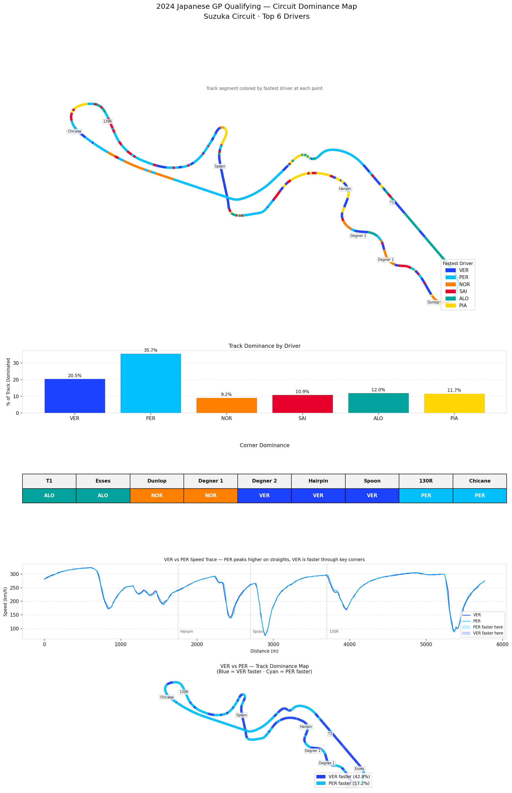

# F1 Circuit Dominance Map — 2024 Japanese GP Qualifying

**Top 6 Drivers · Suzuka Circuit**



---

## Overview

This project uses the [FastF1](https://github.com/theOehrly/Fast-F1) Python library to build a **circuit dominance map** for the 2024 Japanese Grand Prix Qualifying session at Suzuka. Every segment of the track is colored by whichever driver was travelling fastest at that point, across the top 6 qualifiers.

The central question this project answers: **does dominating more of the track mean you're faster overall?** The answer, as the data shows, is no — and the reason why is one of the most important concepts in F1 lap time analysis.

---

## Qualifying Results (Top 6)

| Pos | Driver | Team | Lap Time |
|-----|--------|------|----------|
| 1 | VER | Red Bull Racing | 1:28.197 |
| 2 | PER | Red Bull Racing | 1:28.263 |
| 3 | NOR | McLaren | 1:28.489 |
| 4 | SAI | Ferrari | 1:28.682 |
| 5 | ALO | Aston Martin | 1:28.686 |
| 6 | PIA | McLaren | 1:28.760 |

---

## Key Findings

### The PER Paradox — More Track, Slower Lap

The most striking finding in this analysis: **PER was the fastest driver at 35.7% of track points**, more than double VER's 20.5%. In a direct head-to-head comparison, PER was faster at **57.2% of locations** around Suzuka — yet finished qualifying **0.066s behind** VER in P2.

This apparent contradiction is explained by *where* each driver held the advantage:

- **PER was faster on straights** — sections where all cars are at full throttle and speed differences between drivers are small. Being 5 km/h faster mid-straight gains very little time because the duration is short and the gap closes quickly.
- **VER was faster through the critical corners** — specifically Degner 2, Hairpin, and Spoon. These are the corners that feed directly into the longest acceleration zones on the circuit. A higher minimum speed through these corners means VER carried more speed onto the following straights for longer, compounding the time gain over the full lap.

This is a core principle of F1 lap time: **corner exit speed is worth more than straight-line speed**. A driver who brakes slightly later but hits the apex with 5 km/h less than their teammate will lose more time than they gained at the braking point.

### Corner Dominance Breakdown

| Corner | Winner | Significance |
|--------|--------|-------------|
| T1 | ALO | Aston Martin's high-speed entry strength |
| Esses | ALO | Flowing S-curves suit ALO's smooth style |
| Dunlop | NOR | McLaren's technical sector strength |
| Degner 1 | NOR | McLaren strong through the technical section |
| Degner 2 | VER | Critical corner — feeds the back straight |
| Hairpin | VER | Tightest corner, exit speed is everything |
| Spoon | VER | Long radius, VER's corner exit dominance |
| 130R | PER | Near-flat high speed, Red Bull straight-line |
| Chicane | PER | Final sector where lap is already decided |

### ALO's Surprising Early Sector Dominance

Alonso (Aston Martin) owned both T1 and the Esses — the opening high-speed complex — despite qualifying P5. This suggests the Aston Martin AM24 had strong aerodynamic balance through high-speed corners but lacked the engine power and mechanical grip to compete through the slower technical sections where the Red Bulls and McLarens pulled away.

### McLaren's Technical Sector Strength

NOR dominated Dunlop and Degner 1 — the mid-speed technical section — which aligns with McLaren's known 2024 strength in medium-speed corners. The MCL38's suspension setup gave Norris excellent stability through direction changes, allowing earlier throttle application than his rivals.

---

## Technical Notes

- **Speed dominance vs lap time:** This analysis measures point-by-point speed, not time — a driver can "dominate" more of the track by speed while still being slower overall if their advantages come in low-value locations
- **Reference driver:** VER's telemetry is used as the positional reference (X/Y coordinates) for the circuit map; all other drivers' speeds are interpolated onto VER's distance axis
- **Interpolation:** All 6 speed traces are mapped to a common 1000-point distance axis using `np.interp` for fair comparison
- **Color scheme:** Unique per-driver colors are used (overriding team colors) to distinguish same-team teammates NOR/PIA and VER/PER

---

## Future Improvments
I measured dominance by peak speed at each point — but peak speed at a point is largely determined by the corner before it, not the driver's skill at that exact location. A driver who brakes later into a corner will have lower speed mid-corner but higher speed exiting — the metric would show them as "slower" at the corner and "faster" on the straight, which is actually the same action.
The problem of this corner dominance table is that it's measuring speed at a single point per corner, not through the whole corner. A more meaningful metric would be minimum speed through the corner (which measures how well the driver carries speed) combined with exit speed (which measures how early they can apply throttle). 
So, in the future I will replace point-speed with minimum corner speed + exit acceleration per corner. This separates "fast through corner" from "fast after corner" which I believe would provide a more analytically meaningful distinction.

---

## How to Run

```bash
# 1. Clone the repo
git clone https://github.com/YOUR_USERNAME/f1-dominance-map.git
cd f1-dominance-map

# 2. Install dependencies
pip install -r requirements.txt

# 3. Run the analysis
python analysis.py
```

Session data downloads automatically on first run and is cached to `f1_cache/` for subsequent runs.

---

## Project Structure

```
f1-dominance-map/
├── analysis.py          # Main analysis script
├── requirements.txt     # Python dependencies
├── README.md            # This file
├── f1_cache/            # FastF1 session cache (auto-created, gitignored)
└── outputs/
    └── japan_gp_dominance_map.png
```


---

## Data Source

All data sourced from the official F1 timing feed via [FastF1](https://github.com/theOehrly/Fast-F1).
